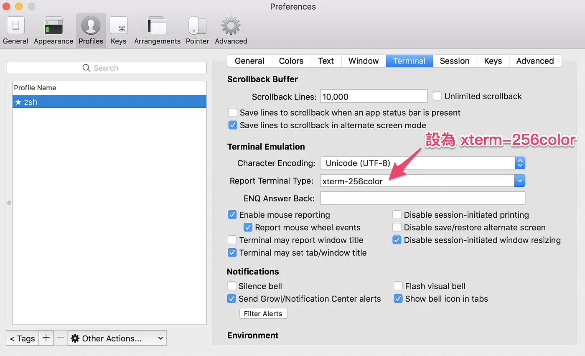
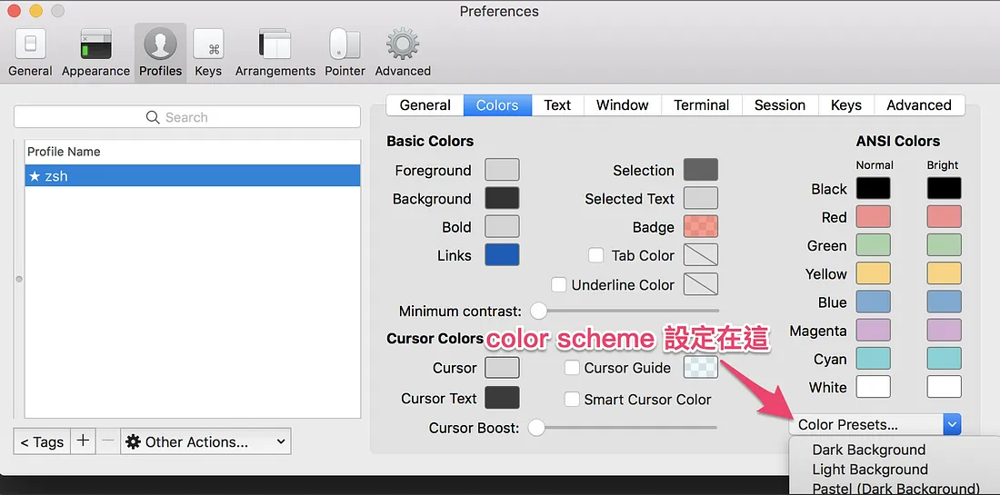
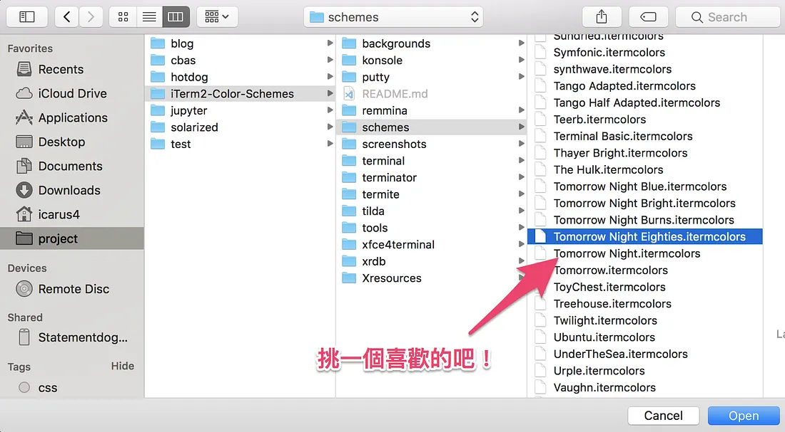
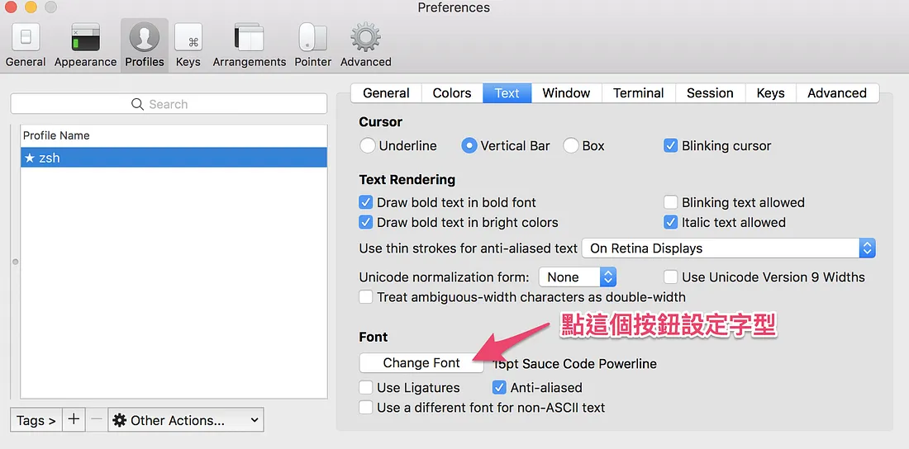

# MacOS Startup

> 最後檢查日期: 2026/01/31

## Homebrew, Iterm2 \[Terminal\]

```shell
mkdir -p ~/development/terminal

# ------------------------------------------------
echo "------- Install homebrew -------" &&
/bin/bash -c "$(curl -fsSL https://raw.githubusercontent.com/Homebrew/install/HEAD/install.sh)" &&

# ------------------------------------------------
echo "------- (Terminal) Install Iterm2 -------" &&
# https://home.gamer.com.tw/creationDetail.php?sn=4841894

brew install --cask iterm2 &&
brew install svn &&

# ------------------------------------------------
echo "------- (Terminal) Download Iterm2 color schemes & Fonts -------" &&
mkdir -p ~/development/terminal
cd ~/development/terminal
git clone https://github.com/mbadolato/iTerm2-Color-Schemes

echo "download font" &&
brew install --cask font-sauce-code-pro-nerd-font &&

# ------------------------------------------------
echo "------- (Terminal) Install Zsh -------"
# https://home.gamer.com.tw/creationDetail.php?sn=4841894
brew install zsh &&
sudo sh -c "echo $(which zsh) >> /etc/shells" &&
chsh -s $(which zsh) &&

echo "Change zsh shell" &&
chsh -s /bin/zsh &&

# ------------------------------------------------
echo "------- 鍵盤：F1/F2 等為標準功能鍵（生效需重開機） -------" &&
defaults write NSGlobalDomain com.apple.keyboard.fnState -bool true &&
# - 鍵盤 > Function Keys（功能鍵）
#     - 路徑：蘋果選單  > 系統設定 > 鍵盤 > 鍵盤快速鍵… > 功能鍵
#     - [x] 勾選「將 F1, F2 等鍵用作標準功能鍵」(Use F1, F2, etc. keys as standard function keys)

# ------------------------------------------------
echo "------- 軌跡板：點一下來按一下（立即套用） -------" &&
defaults write com.apple.AppleMultitouchTrackpad Clicking -bool true &&
sudo defaults write com.apple.driver.AppleBluetoothMultitouch.trackpad Clicking -bool true &&
/System/Library/PrivateFrameworks/SystemAdministration.framework/Resources/activateSettings -u &&

# ------------------------------------------------
echo "------- All complete, restart -------"
```

手動做以下事情

- 打開 iTerm2 檢查 Report Terminal Type 的設定，設定路徑： `Preferences > Profiles > Terminal > Report Terminal Type`
  
- 修改 color scheme
  設定路徑：`Preferences > Profiles > Colors > Color Presets...`
  
  

  這邊要注意的是點選了檔案 import 以後並不會生效，還要再去 color preset 點選你剛 import 的 scheme 才會生效

- 修改字型
  `Preferences > Profiles > Text > Change Font`
  

  請改成 SauceCodePro Nerd Font 或你自己下載的字型

## Check Iterm2 \[Terminal\]

ref

- [讓 macOS 的 Terminal 又潮又實用：iTerm2 + oh-my-zsh + Powerlevel10k](https://www.onejar99.com/terminal-iterm2-zsh-powerlevel10k/#Step_1_iTerm2)
- [超簡單！十分鐘打造漂亮又好用的 zsh command line 環境](https://medium.com/statementdog-engineering/prettify-your-zsh-command-line-prompt-3ca2acc967f)
- [zsh-autosuggestions](https://github.com/zsh-users/zsh-autosuggestions)

```shell
# ------------------------------------------------
echo "------- (Terminal) Check Iterm2 -------" &&
echo $0 &&
echo $SHELL
```

## Customize Iterm2 \[Terminal\]

```shell
# ------------------------------------------------
# oh-my-zsh
# oh-my-zsh 官方 repo 已遷至 ohmyzsh/ohmyzsh
sh -c "$(curl -fsSL https://raw.githubusercontent.com/ohmyzsh/ohmyzsh/master/tools/install.sh)" &&
# 舊的安裝連結：https://raw.githubusercontent.com/robbyrussell/oh-my-zsh/master/tools/install.sh
source ~/.zshrc &&
cp ~/.zshrc ~/backup_default.zshrc &&
vim ~/.zshrc &&

# install powerlevel10k theme
git clone https://github.com/romkatv/powerlevel10k ~/.oh-my-zsh/custom/themes/powerlevel10k &&
exec $SHELL && # 重新載入、立即套用

# install autosuggestions
git clone https://github.com/zsh-users/zsh-autosuggestions ${ZSH_CUSTOM:-~/.oh-my-zsh/custom}/plugins/zsh-autosuggestions

```

~/.zshrc 內容

```.zshrc
# For zsh (add to ~/.zshrc). 請將 weijiewu 改為你的使用者名稱 (不能使用 `~`)：
export PATH="/Users/weijiewu/fvm/bin:$PATH"

# 需找到 plugins 並手動新增，用空格分開
plugins=(
    git zsh-autosuggestions # other plugins...
)

ZSH_THEME="powerlevel10k/powerlevel10k"

# 左側
POWERLEVEL9K_LEFT_PROMPT_ELEMENTS=(context dir dir_writable vcs vi_mode)

# 右側
POWERLEVEL9K_RIGHT_PROMPT_ELEMENTS=(status background_jobs history ram load time)

# 若當前登入的帳號為你的帳號 xxx，就不用特別顯示出來
DEFAULT_USER="xxx"

# 使用 nerd font 時可以顯示更多 icon。詳情請參考 powerlevel9k wiki
POWERLEVEL9K_MODE='nerdfont-complete'

# -----------------------------------------
# 要注意上面的內容在 source 之前
# source oh-my-zsh config
source $ZSH/oh-my-zsh.sh
```

## Install packages

```shell
# ------------------------------------------------
echo "------- Install homebrew packages -------" &&

brew install svn &&
brew install wget &&
brew install git &&
brew install gh &&  # GitHub CLI

# Git 與 GitHub（請改為你的 name / email）
git config --global user.name "Jay Wu" &&
git config --global user.email "weeihua1003@gmail.com" &&
gh auth login &&  # 互動式，登入 GitHub

brew install scrcpy &&
brew install android-platform-tools &&  # adb 工具

brew install --cask google-chrome &&
brew install --cask sublime-text &&
brew install --cask sourcetree &&
brew install --cask android-studio &&
brew install --cask insomnia &&
brew install --cask scroll-reverser &&
brew install --cask obsidian &&
brew install --cask drawio &&
brew install --cask bitwarden &&
brew install --cask youtube-downloader &&
brew install --cask cursor &&
brew install --cask betterdisplay &&
brew install --cask raycast &&
brew install cocoapods &&  # ai 建議用 homebrew 裝，比較不會有依賴問題

# ------------------------------------------------
echo "------- Flutter (FVM，官方建議用 script 安裝，見 https://fvm.app/documentation/getting-started/installation) -------" &&
curl -fsSL https://fvm.app/install.sh | bash &&

# 手動加 PATH 到 ~/.zshrc（請將 weijiewu 改為你的使用者名稱，勿用 ~）：
# export PATH="/Users/weijiewu/fvm/bin:$PATH"
# 然後執行：source ~/.zshrc

# ------------------------------------------------
echo "------- Android ENV -------" &&
export PATH=~/Library/Android/sdk/tools:$PATH
export PATH=~/Library/Android/sdk/platform-tools:$PATH

# ------------------------------------------------
echo "------- Android ENV -------" &&
brew install mas &&
mas install 497799835 && # (mas search xcode) 這是 Xcode 的 ID
mas install 539883307 && # ID of Line on app store
mas install 899247664 && # ID of TestFlight on app store
mas install 425424353 && # The Unarchiver (如果要解壓縮 RAR 等)
mas install 1450874784 && # Transporter

# mas install 993841014 && # CopyLess 2, 剪貼簿管理工具，其他選擇：Maccy（付費）
# 用 raycast 搜尋 clipboard history 就好了

# 應該不需要?
# - 超级右键-iRightMouse 1497428978

```

## 需要手動的

- 系統偏好設定
  - 滑鼠
    - [x] 輔助按鈕、右鍵
  - 軌跡板 (Trackpad)
    - **追蹤速度** (Tracking Speed)：系統設定 > 軌跡板 > 軌跡板選項…（或 更多手勢 旁）
  - Touch ID：設定指紋解鎖／付款
- **預設瀏覽器**：改為 Chrome
- **Chrome 同步**：登入帳號時注意要同步哪些資料（書籤、密碼、擴充功能、分頁等），依隱私需求勾選
- Scroll Reverser (設定: 反轉垂直、套用裝置取消勾選軌跡板)
- Xcode
  - FileMerge 拖到 Dock

### Cursor

- Auto-Run 改為 Run Everything：`設定 > Agents > Auto-Run > Auto-Run Mode` 選「Run Everything (Unsandboxed)」
- 設定字體

`設定 > 功能 > 終端機 > Integrated: Font Family`

```
'SauceCodePro Nerd Font Mono', ... 其他字型
```

### Raycast

> 有買 Pro 好像就不用手動？

- Color Picker
- GitHub
- Google Translate
- ChatGPT
- raycast-gemini
- Bitwarden
- Cursor
- Google Search
- Obsidian
- Installed Extensions (安裝套件來檢視安裝了哪些套件...)

---

https://www.rorybowcott.com/post/my-top-10-raycast-extensions#viewer-9c38c

- Bitwarden 
- Homebrew 
- Toolbox 
- Change Case 
- ColorSlurp 
- Kill Process 
- Lorem Ipsum 

---

- Open With 
- Google Fonts
- Unsplash 

### .zshrc

```zshrc
# 這三行解決： cocoa pods 問題
# https://stackoverflow.com/questions/59405671/ios-cocoapods-requires-your-terminal-to-be-using-utf-8-encoding-after-latest
export LANG=en_US.UTF-8
export LANGUAGE=en_US.UTF-8
export LC_ALL=en_US.UTF-8
```

### 其他

這安裝會很久... 要注意

```shell
sudo gem install cocoapods
```

